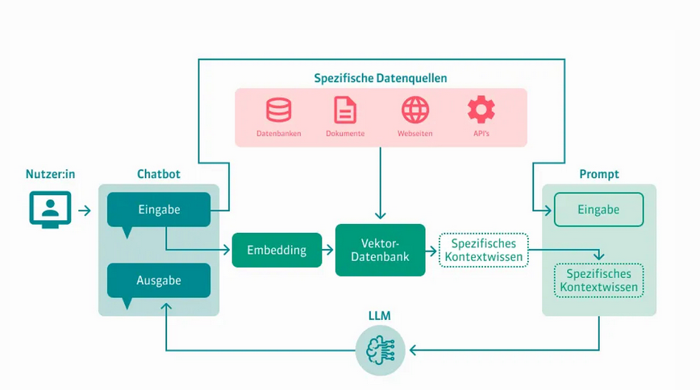

### Was ist RAG ?
RAG steht für "Retrieval-Augmented Generation" und bezeichnet ein Verfahren, das Information Retrieval (Informationsabruf) mit Textgenerierung kombiniert, um wissensintensive Aufgaben zu bewältigen (Lewis et al., 2020). Im Gegensatz zu herkömmlichen Sprachmodellen, die ausschließlich auf ihr Trainingsgewicht angewiesen sind, können RAG-Systeme externe Wissensdatenbanken konsultieren, was aktuellere und präzisere Antworten ermöglicht

### Welche Herausforderungen löst der RAG-Ansatz?

#### Problem 1: LLM-Modelle kennen Ihre Daten nicht
LLMs nutzen Deep-Learning-Modelle und trainieren mit riesigen Datasets, um Daten zu verstehen und zusammenzufassen und neue Inhalte zu generieren. Die meisten LLMs werden mit einer breiten Palette öffentlicher Daten trainiert, damit ein Modell viele verschiedene Arten von Aufgaben oder Fragen lösen kann. Nach dem Training können viele LLMs nicht mehr auf Daten zugreifen, die über ihren Trainingsdatenbestand hinausgehen. Dadurch werden LLMs statisch und können fehlerhaft reagieren, veraltete Antworten geben oder halluzinieren, wenn ihnen Fragen zu Daten gestellt werden, für die sie nicht trainiert wurden.

#### Problem 2: KI-Anwendungen müssen maßgeschneiderte Daten nutzen, um effektiv zu sein
Damit LLMs relevante und konkrete Antworten geben können, müssen die Unternehmen dafür sorgen, dass das Modell das betreffende Fachgebiet versteht und Antworten auf der Grundlage seiner Daten liefert, anstatt allgemeine und pauschale Antworten zu geben. Unternehmen entwickeln beispielsweise Kundensupport-Bots mit LLMs, und diese Lösungen sollen unternehmensspezifische Antworten auf Kundenfragen geben. Andere arbeiten an internen Q&A-Bots, die Fragen von Mitarbeitern zu internen HR-Daten beantworten sollen. Wie können Unternehmen solche Lösungen entwickeln, ohne diese Modelle neu zu trainieren?

#### Lösung: Retrieval Augmentation Generation – der neue Industriestandard
Eine gleichermaßen einfache wie beliebte Möglichkeit, eigene Daten zu verwenden, besteht darin, sie als Teil des Prompts anzugeben, mit dem Sie das LLM-Modell abfragen. Dies wird als Retrieval Augmented Generation (RAG) bezeichnet: Sie rufen relevante Daten ab und nutzen sie als erweiterten Kontext für das LLM. Statt sich also ausschließlich auf das aus den Trainingsdaten abgeleitete Wissen zu verlassen, zieht ein RAG-Workflow relevante Informationen heran und verbindet statische LLMs mit Echtzeitdatenabfragen.

Mit der RAG-Architektur können Unternehmen jedes beliebige LLM-Modell einsetzen und es so erweitern, dass es relevante Ergebnisse für ihr Unternehmen liefert, indem sie ihm eine kleine Menge ihrer Daten zur Verfügung stellen. Dabei fallen weder Kosten noch Zeit für Fine-Tuning oder Pre-Training des Modells an.

### Welche Vorteile bietet RAG?
Der RAG-Ansatz bietet eine Reihe wesentlicher Vorteile:

- Er liefert aktuelle und fehlerfreie Antworten: RAG sorgt dafür, dass die Reaktion eines LLM nicht nur auf statischen, veralteten Trainingsdaten basiert. Stattdessen nutzt das Modell aktuelle externe Datenquellen, um Antworten zu geben.

- Er sorgt für weniger falsche Antworten oder Halluzinationen: Indem die Ausgabe des LLM-Modells auf relevantes externes Wissen aufsetzt, versucht RAG, das Risiko falscher oder erfundener Informationen (sogenannter „Halluzinationen“) zu vermeiden. Die Ausgaben können Zitate aus Originalquellen enthalten, sodass eine Überprüfung durch den Menschen möglich ist.

- Er stellt fachspezifische und relevante Antworten bereit: Mithilfe von RAG kann das LLM kontextbezogene Antworten geben, die auf die unternehmenseigenen oder fachspezifischen Daten zugeschnitten sind.

- Er ist hocheffizient und kostengünstig: Im Vergleich zu anderen Ansätzen zur Anpassung von LLMs mit fachspezifischen Daten ist RAG einfach und kostengünstig. Unternehmen können RAG sofort einsetzen, ohne das Modell anpassen zu müssen. Dies ist besonders vorteilhaft, wenn Modelle häufig mit neuen Daten aktualisiert werden müssen.

### Wie funktionieren RAG-Systeme ?

#### RAG - Schritt 1: Abrufen von relevanten Informationen (Retrieve)
Der erste Schritt in der Funktionsweise von Retrieval Augmented Generation ist das Abrufen relevanter Informationen aus einer großen Datenbank oder einem Wissenspool. Wird beispielsweise eine Benutzeranfrage in einen Chatbot eingegeben, wird diese durch ein Ebedding-Modell in eine Vektordarstellung umgewandelt und mit der vorhandenen Vektordatenbank abgeglichen. Dabei sucht die Vektor-Datenbank nach den Vektoren, die der Anfrage am ähnlichsten sind.

#### RAG - Schritt 2: Einbindung von relevante Informationen (Augment)
Als nächstes  werden die relevanten Informationen im RAG-System mit Hilfe von Prompt-Techniken in den Kontext der ursprünglichen Aufforderung eingefügt. Das Ergebnis ist eine erweiterte Aufforderung, die sowohl die ursprüngliche Eingabe als auch die relevanten Informationen enthält. Die erweiterte Aufforderung wird an das LLM gesendet, um eine präzise und aktuelle Antwort zu generieren. So gelangen die relevante Informationen in die Generierung der Antwort ein.

#### RAG - Schritt 3: Generierung der Antwort (Generate)
Nachdem das RAG-System die spezifischen Informationen gefunden und dem LLM in der erweiterten Aufforderung zur Verfügung gestellt hat, erfolgt die Generierung der Antwort. Dafür nutzt das LLM die vorliegende Wissensbasis aus seinen Trainingsdaten und den bereitgestellten Informationen und formuliert eine Antwort in natürlicher Sprache.

### Welche methodischen/technischen unterschiedliche Ansätze gibt es bei den RAG-Systemen

#### dahinterliegende Datenbanken
- Vektordatenbanken: Spezialisiert auf die Speicherung und Abfrage von Vektordarstellungen (Pinecone, Weaviate, Chroma, FAISS)
- Dokumentendatenbanken: Für unstrukturierte Inhalte (MongoDB, Elasticsearch)
- Relationale Datenbanken: Für strukturierte Daten mit klaren Beziehungen (PostgreSQL mit Vektorerweiterungen)
- Graphdatenbanken: Für komplexe Beziehungen zwischen Entitäten (Neo4j)

#### Suchstrategien

- Vektorsuche
Die Vektorsuche nutzt semantische Embeddings, um relevante Inhalte basierend auf der Bedeutung zu finden. Dies ermöglicht es, auch bei unterschiedlichen Formulierungen passende Informationen zu identifizieren. Vektorsuche ist besonders effektiv bei unstrukturierten Daten wie Texten.

- Hybride Suche
Die hybride Suche kombiniert Vektorsuche mit klassischer Schlüsselwortsuche. Dadurch werden sowohl semantische als auch exakte Übereinstimmungen berücksichtigt, was die Relevanz der Suchergebnisse erhöht.

- Chunking
Beim Chunking werden Dokumente in kleinere Abschnitte (Chunks) unterteilt, um die Granularität der Suche zu verbessern. Dies kann durch feste Längen, satzbasierte oder formatbasierte Methoden erfolgen.

- Re-Ranking
Nach der initialen Suche werden die Ergebnisse neu bewertet und sortiert, um die relevantesten Informationen an oberster Stelle zu präsentieren. Dies kann durch zusätzliche Modelle oder Heuristiken erfolgen.

- Query Rewriting
Die ursprüngliche Anfrage wird umformuliert oder erweitert, um die Suchergebnisse zu verbessern. Dies ist besonders nützlich bei komplexen oder mehrdeutigen Fragen.

- Kontextuelle Kompression und Filterung
Diese Technik reduziert die Größe und Komplexität der abgerufenen Dokumente, indem irrelevante oder redundante Informationen entfernt werden. Dadurch wird die Qualität und Nützlichkeit der Informationen erhöht

### Welche Sprachen sind aktuell in Deutschland besonders häufig vertreten?

In Deutschland ist Deutsch die dominierende Sprache im häuslichen Umfeld. Laut dem Mikrozensus 2023 des Statistischen Bundesamts sprechen etwa 77 % der Bevölkerung zu Hause ausschließlich Deutsch. Weitere 17 % nutzen neben Deutsch mindestens eine weitere Sprache, während 6 % ausschließlich andere Sprachen sprechen.

#### Häufig gesprochene Sprachen in deutschen Haushalten

Unter den Personen, die zu Hause vorwiegend oder ausschließlich eine andere Sprache als Deutsch sprechen, sind die am häufigsten vertretenen Sprachen:

https://ebs.publicnow.com/view/D8100A16757018F6C82DF5D27FB27EF6EDA72AC3?utm_source=chatgpt.com

    Türkisch (14 %)

    Russisch (12 %)

    Arabisch (9 %)

    Polnisch (7 %)

    Englisch (6 %)

    Rumänisch (5 %)

#### Fremdsprachenkenntnisse in der Bevölkerung

Neben den zu Hause gesprochenen Sprachen gibt es auch Daten zu den Fremdsprachenkenntnissen der Bevölkerung. Laut einer Umfrage von YouGov im Mai 2024 beherrschen Menschen in Deutschland durchschnittlich 2,3 Sprachen. Die am häufigsten gesprochenen Fremdsprachen sind:

https://www.welt.de/kmpkt/article251857230/Fremdsprachen-So-gut-sind-die-Sprachkenntnisse-der-Deutschen.html?utm_source=chatgpt.com

Englisch (68,8 %)

Französisch (17,3 %)

Spanisch (9,6 %)

Russisch (6,0 %)

Italienisch (5,8 %)

Türkisch (3,3 %)

Polnisch (2,4 %)

Arabisch (2,4 %)

Niederländisch (2,1 %)